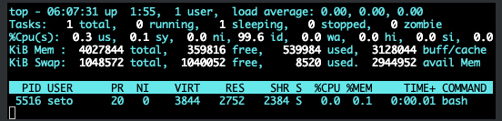
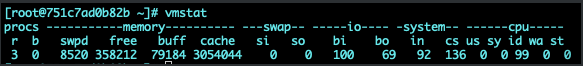
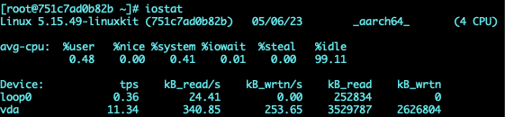
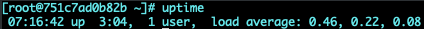
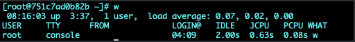
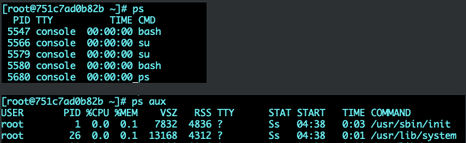
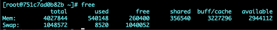
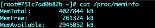

## 総合的なリソース使用率の測定

**top**  
option(-b, -d, -n, -u, -p)  
システムリソースの使用状況やプロセスの実行状態などを継続的に監視する。

現在日時は06:07:31で起動してから1:55が経過。ログインユーザ数は1です。  
load averageは平均負荷。3つの数字は1,5,15分の平均数。cpuコア数を超えると何らかの処理まちが発生していると考えられる。2行目にはプロセスの状態ごとの数が表示される。3行目はCPUの状態。us: ユーザがプロセスのCPUを使用している割合, sy: カーネルがCPUを使用している割合, ni: 優先度が変更されたプロセスがCPUを使用している割合, id: CPUがアイドル状態の時間の割合, io: ディスクI/O待ちの時間の割合, hi:  ハードウェア割り込み要求時間の割合, si: ソフトウェア割り込み要求時間の割合, st: ゲストOSがCPUを割り当てられなかった割合。4行目はメモリ、5行目はスワップの状況を示す。左から、全部物理メモリ量, 空きメモリ量, 使用済みメモリ量, バッファ及びキャッシュサイズ, abail Mem: メモリ不足時に利用可能な物理メモリ量。

＜タスクエリア＞
- PR: 実行優先度
- NI: nice値
- VIRT: 使用中の仮想メモリ(KB)
- RES: 使用中の実メモリ(KB)
- SHR: 共有メモリサイズ(KB)
- S: プロセスの状態
- %CPU: CPUの使用率(%)
- %MEM: 物理メモリの使用率(%)
- TIME+: プロセスが開始して使用したCPU時間の総計
- COMMAND: 実行コマンド

**vmstat** 
option(表示間隔　回数)
メモリ及び仮想メモリの詳細な状態を継続的に監視できる  

- procs
  - r: 実行待ちプロセス数
  - b: 割り込み不可能なスリープ状態にあるプロセス数
- swap
  - si: ディスクからスワップインされているメモリサイズ
  - so: ディスクへスワップアウトされているメモリサイズ
- cpu
  - sy: カーネルがCPUを使用している時間の割合
  - id: CPUがアイドル状態の時間の割合
  - wa: ディスクI/O待ちの時間の割合

**iostat**  
option(-c, -d, -k, -t)  
CPUの使用状況とディスクの入出力に関する情報を継続的に監視できる。主にディスクI/Oを調べる場合に使う。  

**iotop**  

**sar**  
option(-s, -e, -f, 表示間隔)  
多機能で、様々なシステム統計情報のレポートを得ることができる。

**sadf**  
option(-j, -x, -t, --)  
メモリ関連情報をタブ区切りテキストで出力する  

**uptime**  

topコマンドの一行目とほとんど同じ

**w**  
option(-h, -s)  
現在ログインしているユーザと各ユーザーのプロセス情報が表示される

- TTY: 端末名
- JCPU: 当該端末から実行されている全プロセスが消費したCPU時間
- PCPU: WHAT欄に表示されるカレントプロセスが消費したCPU時間

## CPU使用率の測定

**ps**  
CPUの使用率を測定するには、先に挙げたtop, vmstat, iostat, sadc / sar コマンドなどが利用できる。  
psコマンドを利用することでプロセス単位でより詳細な情報を確認することができる

- VSG: プロセスが使用するメモリ量
- RSS: 現時点で使用中のメモリ量
- STAT: プロセスの状態と優先度

**pstree**  
プロセスの親子関係をツリー状に表示できる  

lsofコマンドも同じように使える

## メモリ及びスワップ使用量の測定

**free**  
option(-b, -k, -m, -t, -o, -s)  
メモリ使用量を測定するには、先に挙げたtop, sadc / sarコマンドなどが利用できる他、freeコマンドも利用できる。  

より詳細なメモリ使用量を確認する場合、、/proc/meminfoを参照する。

## ディスク使用量の測定

**df**  
option(-a, -h, -H, -i, -l, -m, -T)
キャパシティプランニングではディスクI/Oだけでなく、ディスクの使用量にも注意を払う必要がある。ディスク使用量を測定するにはdfコマンドを利用できます。dfコマンドを使用すると、ディスクの使用量や使用している割合を確認できる。

## ネットワークトラフィックの測定

**netstat**  
ネットワークインターフェースの情報はnetstatコマンドで調べることができる  
-sオプションで、プロトコルごとの統計情報を表示できる。  

- RX-ERR: 受信におけるエラー数
- TX-ERR: 転送におけるエラー数
- RX-DRP: 受信時の取りこぼし数
- TX-DRP: 転送時の取りこぼし数

**ss**  
netstatコマンドを代替となるssコマンドでは、-sオプションで接続状態の統計を見ることができる。  

**netserver**  
netperfを使うと、2つのホスト間でネットワークのスループットを計測できる。サーバ側ではnetserverコマンドを使って接続を待ち受ける。  

> netserver

> netperf -H 192.168.10.58  

iptrafコマンドを使うと、ネットワークインターフェースのトラフィックをモニターすることができる。  

## リソース需要の分析と予測
## リソース監視ツール

**collectd**  
collectdはシステムの各種情報を定期的に収集する軽量なデーモンです。様々な情報を収集できる。  

**Nagios**  
オープンソースのシステム監視、ネットワーク監視を行うアプリ  

**MRTG**  
ルーターなどのネットワーク機器が通信した量をグラフ化するツール

**Cacti**  
MRTGの代替となるソフトウェア  

**Icinga2**  
Nagiosからフォークした総合監視ツール
